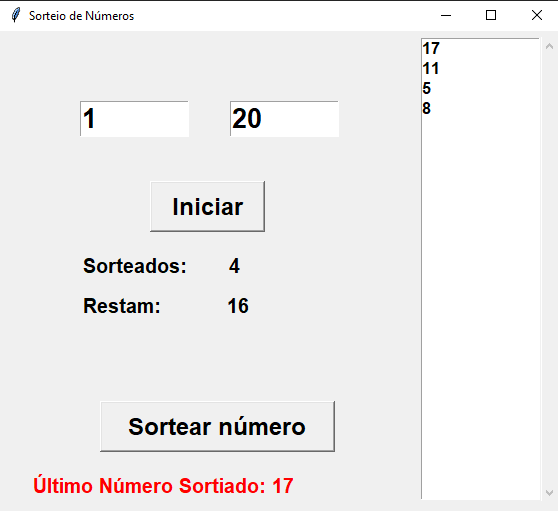

# Aplicativo para sorteio de números
### Aplicação desktop desenvolvida em python usando tkinter para sorteio de números

Você informa o número inicial e final do range de números, e ao clicar em iniciar o programa ira gerar o range e zerar os números sorteados.

Após isso basta clicar no botão de 'Sortear número' para sortear um número

